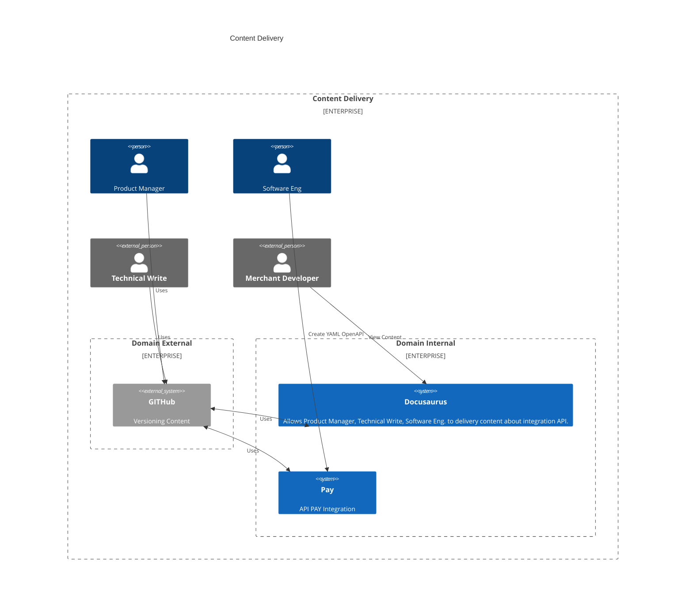

POC Manu - Docusaurus - OpenAPI Direct (PSE (CO) , OXXOPAY (MX) , and PIX (BR)  )

```mermaid
    C4Context
      title Content Delivery
      Enterprise_Boundary(b0, "Content Delivery") {

        Person(productManager, "", "Product Manager")
        Person(softwareEng, "", "Software Eng")
        Person_Ext(technicalWrite, "Technical Write")
        Person_Ext(developerMerchant, "Merchant Developer")
        
        Enterprise_Boundary(b2, "Domain External") {
            System_Ext(GITHub, "GITHub", "Versioning Content")
        }
        
        Enterprise_Boundary(b1, "Domain Internal") {
            System(Docusaurus, "Docusaurus", "Allows Product Manager, Technical Write, Software Eng. to delivery content about integration API.")
            System(pay, "Pay", "API PAY Integration ")
        }
        
        
        Rel(developerMerchant, Docusaurus, "View Content")
        Rel(productManager, GITHub, "Uses")

        Rel(technicalWrite, GITHub, "Uses")
        BiRel(Docusaurus, GITHub, "Uses")
        BiRel(pay, GITHub, "Uses")
        Rel(softwareEng, pay, "Create YAML OpenAPI")
         
      }
```